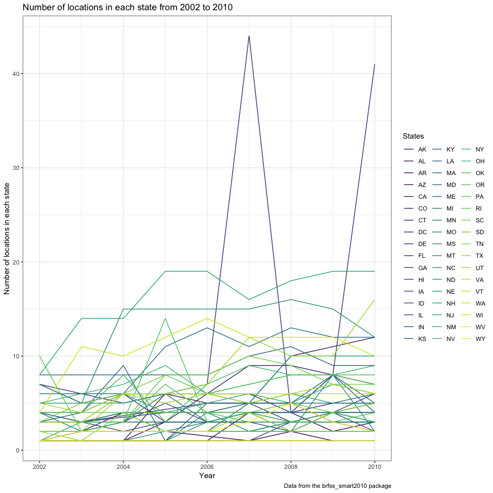
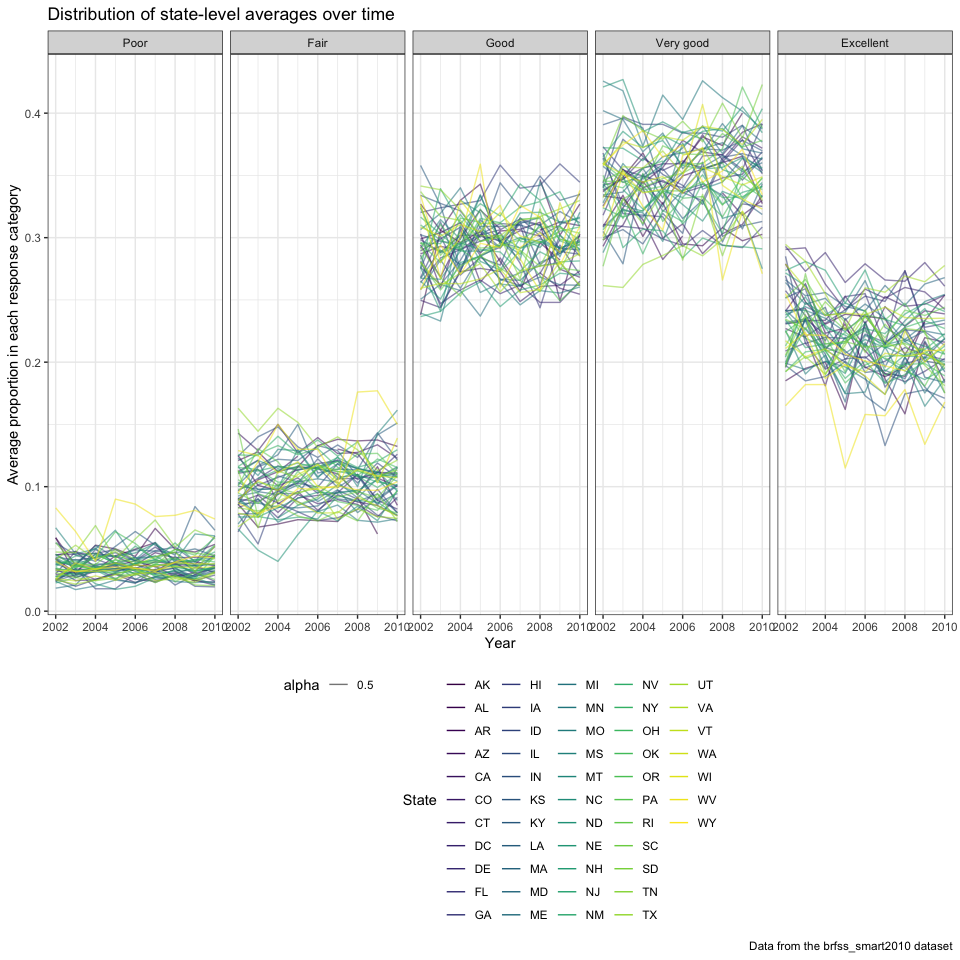
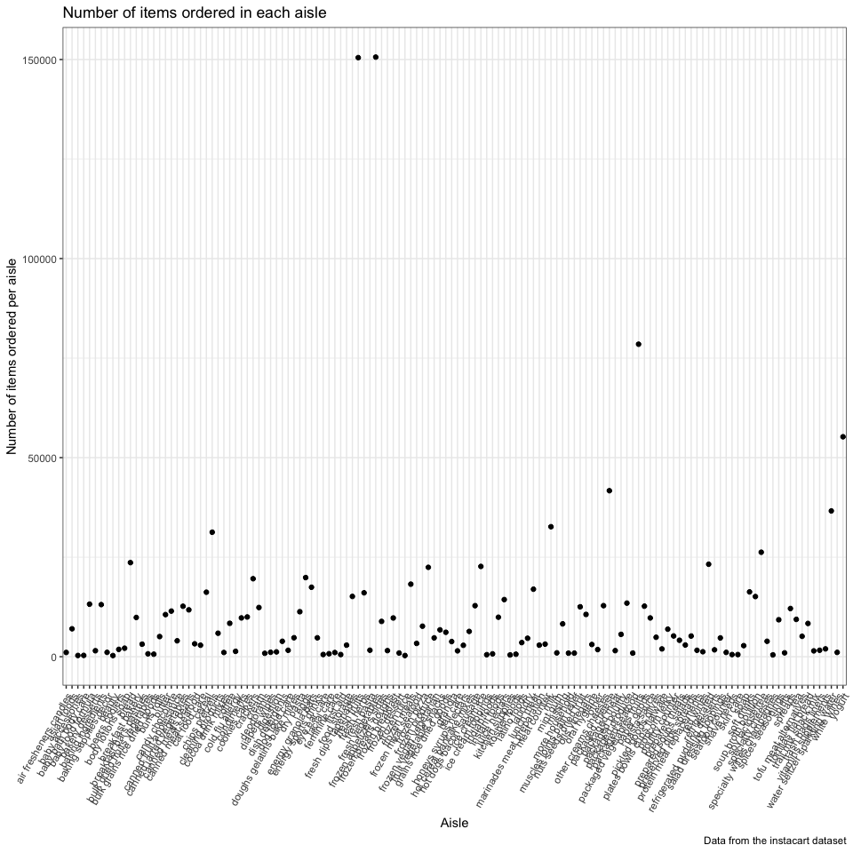
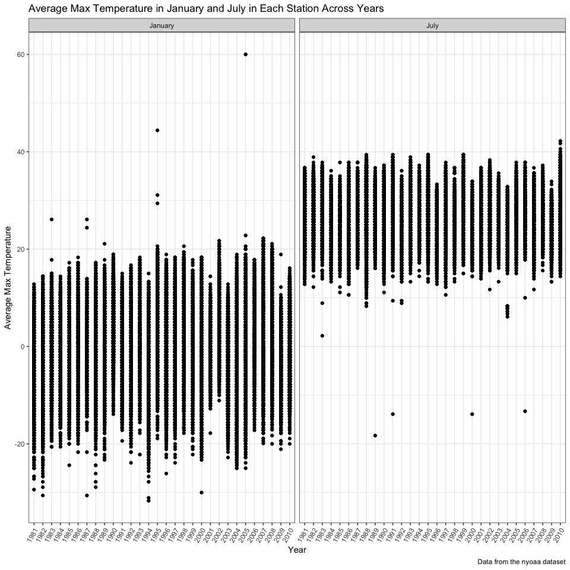
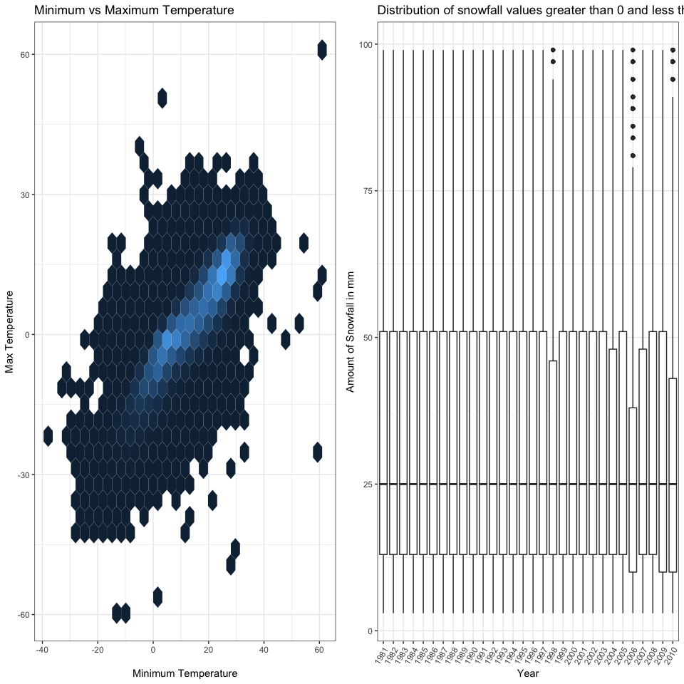

Homework 3
================
Diana Ballesteros Gonzalez (deg2163)
10/11/2018

``` r
knitr::opts_chunk$set(echo = TRUE)

library(tidyverse)
```

    ## ── Attaching packages ──────────────────────────────────────────── tidyverse 1.2.1 ──

    ## ✔ ggplot2 3.0.0     ✔ purrr   0.2.5
    ## ✔ tibble  1.4.2     ✔ dplyr   0.7.6
    ## ✔ tidyr   0.8.1     ✔ stringr 1.3.1
    ## ✔ readr   1.1.1     ✔ forcats 0.3.0

    ## ── Conflicts ─────────────────────────────────────────────── tidyverse_conflicts() ──
    ## ✖ dplyr::filter() masks stats::filter()
    ## ✖ dplyr::lag()    masks stats::lag()

``` r
library(ggridges)
```

    ## 
    ## Attaching package: 'ggridges'

    ## The following object is masked from 'package:ggplot2':
    ## 
    ##     scale_discrete_manual

``` r
knitr::opts_chunk$set(
  fig.width = 10,
  fig.asp = 1.0,
  out.width = "90%"
)

theme_set(theme_bw() + theme(legend.position = "bottom"))
```

### **Problem 1**

``` r
# install.packages("devtools")
devtools::install_github("p8105/p8105.datasets")
```

    ## Skipping install of 'p8105.datasets' from a github remote, the SHA1 (21f5ad1c) has not changed since last install.
    ##   Use `force = TRUE` to force installation

``` r
## loading the library
library(p8105.datasets)
```

``` r
## Load the data for brfss_smart2010
data("brfss_smart2010")
```

``` r
## cleaning the dataset 
brfss_smart2010_clean = 
   brfss_smart2010 %>% 
   janitor::clean_names() %>% 
   rename(state = locationabbr, county = locationdesc) %>% 
   filter(topic == "Overall Health" & (response == "Excellent" | 
                                       response == "Very good" |
                                       response == "Good" | response == "Fair" | 
                                       response == "Poor")) %>% 
   mutate(response = ordered(response, 
                             levels = c("Poor", "Fair", "Good", "Very good", "Excellent")))
```

The states that were observed at 7 locations in 2002 were:

``` r
brfss_smart2010_clean %>%
  filter(year == 2002) %>% 
  group_by(state) %>% 
  distinct(county) %>% count() %>% 
  filter(n == 7) %>% 
  select(-n) %>% 
  knitr::kable()
```

| state |
|:------|
| CT    |
| FL    |
| NC    |

“Spaghetti plot” that shows the number of locations in each state from 2002 to 2010.

``` r
## Creating a spaghetti plot 
brfss_smart2010_clean %>% 
  group_by(state, year) %>% 
  distinct(county) %>%
  summarize(count_county = n()) %>% 
  ggplot(aes(x = year, y = count_county, color = state)) + 
  geom_line() + 
  labs(
    title = "Number of locations in each state from 2002 to 2010",
    x = "Year",
    y = "Number of locations in each state",
    caption = "Data from the brfss_smart2010 package"
  ) + 
  viridis::scale_color_viridis(
    name = "States", 
    discrete = TRUE) + 
  theme_bw() 
```



Table showing, for the years 2002, 2006, and 2010, the mean and standard deviation of the proportion of “Excellent” responses across locations in NY State.

``` r
## Creating a table with mean and sd for the prop of excellent responses   
brfss_smart2010_clean %>% 
  filter((year == 2002 | year == 2006 | year == 2010) & state == "NY" 
         & response == "Excellent") %>% 
  group_by(year) %>% 
  spread(key = response, value = data_value) %>% 
  janitor::clean_names() %>% 
  summarize(mean_excellent = mean(excellent),
            sd_excellent = sd(excellent, na.rm = TRUE)) %>% 
  mutate(mean_excellent = mean_excellent / 100, 
        sd_excellent = sd_excellent / 100)  %>% 
  knitr::kable(digits = 2)
```

|  year|  mean\_excellent|  sd\_excellent|
|-----:|----------------:|--------------:|
|  2002|             0.24|           0.04|
|  2006|             0.23|           0.04|
|  2010|             0.23|           0.04|

For each year and state, compute the average proportion in each response category (taking the average across locations in a state). Make a five-panel plot that shows, for each response category separately, the distribution of these state-level averages over time.

``` r
## Creating a plot for each response category and average prop 
brfss_smart2010_clean %>% 
  group_by(year, state, response) %>% 
  summarize(mean_response_category = mean(data_value/100)) %>% 
  ggplot(aes(x = year, y = mean_response_category, color = state)) + 
  geom_line(aes(alpha = 0.5)) + 
  facet_grid(~response) + 
  labs(
    title = "Distribution of state-level averages over time",
    x = "Year",
    y = "Average proportion in each response category",
    caption = "Data from the brfss_smart2010 dataset"
  ) + 
  viridis::scale_color_viridis(
    name = "State", 
    discrete = TRUE
  )
```

    ## Warning: Removed 3 rows containing missing values (geom_path).



### **Problem 2**

``` r
## Load the data for instacart
data("instacart")
instacart = 
  instacart %>% 
  janitor::clean_names()
```

Description of the dataset: There are 15 variables in the dataset that include information including when the items were ordered, days since the customer's last order, product name, aisle the item was located at, product id, order id, whether the item was reorder, user's id. There are some variables that are not clearly defined including eval\_set,order\_dow. I am assuming that order\_dow is referring to the day of the week the order was placed from 0-6 with 0 being Saturday according to some online research since those are the days with the most instacart orders. The dataset is structured so that each row is a different item from an order that was placed (i.e., 1,384,617 items were ordered via instacart).

``` r
## How many aisles are there?
instacart %>% 
 distinct(aisle_id) %>%
 count()
```

    ## # A tibble: 1 x 1
    ##       n
    ##   <int>
    ## 1   134

There are 134 aisles.

The item where the most items are ordered from:

``` r
## Creting a table for the most items 
instacart %>% 
  group_by(aisle) %>% 
  count(aisle) %>% 
  arrange(desc(n)) %>% 
  head() %>% 
  knitr::kable()
```

| aisle                         |       n|
|:------------------------------|-------:|
| fresh vegetables              |  150609|
| fresh fruits                  |  150473|
| packaged vegetables fruits    |   78493|
| yogurt                        |   55240|
| packaged cheese               |   41699|
| water seltzer sparkling water |   36617|

``` r
## Creating a plot with the aisles with the most items ordered from 
instacart %>% 
  group_by(aisle) %>% 
  count(aisle) %>%
  ggplot(aes(x = aisle, y = n)) + 
  geom_point() + 
  labs(
    title = "Number of items ordered in each aisle",
    x = "Aisle",
    y = "Number of items ordered per aisle",
    caption = "Data from the instacart dataset"
  ) +  
  theme(axis.text.x = element_text(angle = 60, hjust = 1)) 
```



Table showing the most popular item in each of the aisles “baking ingredients”, “dog food care”, and “packaged vegetables fruits”.

``` r
## Creating a table with the most pop items in three aisles 
instacart %>% 
  filter(aisle == "baking ingredients" | 
         aisle == "dog food care" | 
         aisle == "packaged vegetables fruits") %>% 
  group_by(aisle) %>% 
  summarize(most_popular_item = max(product_name)) %>%
  knitr::kable()
```

| aisle                      | most\_popular\_item             |
|:---------------------------|:--------------------------------|
| baking ingredients         | Zero Calorie Sweetener          |
| dog food care              | Zero Grain Turkey Dog Food      |
| packaged vegetables fruits | Zucchini Squash, Baby Courgette |

Table showing the mean hour of the day at which Pink Lady Apples and Coffee Ice Cream are ordered on each day of the week

``` r
## Creating a table with mean hour of the day 
instacart %>% 
  filter(product_name == "Pink Lady Apples" | 
         product_name == "Coffee Ice Cream") %>% 
  group_by(product_name, order_dow) %>% 
  summarize(mean_order_hour_of_day = mean(order_hour_of_day)) %>%
  spread(key = order_dow, value = mean_order_hour_of_day) %>% 
  rename("Product Name" = "product_name", "Saturday" = "0", 
         "Sunday" = "1", "Monday" = "2", "Tuesday" = "3", 
         "Wednesday" = "4", "Thursday" = "5", "Friday" = "6") %>% 
  knitr::kable(digits = 2)
```

| Product Name     |  Saturday|  Sunday|  Monday|  Tuesday|  Wednesday|  Thursday|  Friday|
|:-----------------|---------:|-------:|-------:|--------:|----------:|---------:|-------:|
| Coffee Ice Cream |     13.77|   14.32|   15.38|    15.32|      15.22|     12.26|   13.83|
| Pink Lady Apples |     13.44|   11.36|   11.70|    14.25|      11.55|     12.78|   11.94|

### **Problem 3**

``` r
## Load the data for instacart
data("ny_noaa")
ny_noaa = ny_noaa 
```

Description of the dataset: There are 7 vairables in this dataset with 2,595,176 observations (i.e., number of row). Each row provides information on the precipitation, max and minimum temperature on any given day. Each dataset is : id = station identification code prcp = Precipitation (tenths of mm) snow = Snowfall (mm) snwd = Snow depth (mm) tmax = Maximum temperature (tenths of degrees C) tmin = Minimum temperature (tenths of degrees C)

``` r
## Data cleaning: Separated date into year, month, and day; converted month to list the, converted the units for prcp to inches, tmin/tmax from tenths of degrees C to degrees
ny_noaa_clean = 
  ny_noaa %>% 
  janitor::clean_names() %>% 
  separate(date, into = c("year","month","day"), sep = "-") %>% 
  mutate(month = month.name[as.numeric(month)],
         tmin = as.numeric(tmin, na.rm = TRUE),
         tmax = as.numeric(tmax, na.rm = TRUE), 
         prcp = prcp * 10 / 25.4,
         tmin = tmin / 10,  
         tmax = tmax / 10
         ) 
```

-   The most commonly observed snowfall value is 0, which makes sense because there is no snow most of the year.

Two-panel plot showing the average max temperature in January and in July in each station across years. There are a few outliers for in both months over the years. One that is clearly seen is in January 2005. The plot also shows a lower distribution of temperatures in January in comparison to July, which makes sense because July is typically warmer than in January.

``` r
## Two panel plot for avg max temp in Jan & July 
ny_noaa_clean %>% 
  filter(month == "January" | month == "July") %>% 
  group_by(year, month, tmax) %>% 
  mutate(average_temp_per_month = mean(tmax, na.rm = TRUE)) %>% 
  ggplot(aes(x = year, y = average_temp_per_month)) + 
  geom_point() + 
  facet_grid(~month) + 
  labs(
    title = "Average Max Temperature in January and July in Each Station Across Years",
    x = "Year",
    y = "Average Max Temperature",
    caption = "Data from the nyoaa dataset"
  ) + 
  theme(axis.text.x = element_text(angle = 60, hjust = 1)) 
```

    ## Warning: Removed 190331 rows containing missing values (geom_point).



Two-panel plot showing (i) tmax vs tmin for the full dataset and (ii) a plot showing the distribution of snowfall values greater than 0 and less than 100 separately by year.

``` r
## Load the patchwork library
library(patchwork)

## Install the hexbin package and load it 
library(hexbin)

## Create tmax vs tmin plot 
ny_noaa_tmin_tmax = 
  ny_noaa_clean %>%
  ggplot(aes(x = tmax, y = tmin)) + 
  geom_hex() + 
  labs(
    title = "Minimum vs Maximum Temperature",
    x = "Minimum Temperature",
    y = "Max Temperature") + 
  theme(legend.position = "none")

## Create plot showing the distribution of snowfall values greater than 0 and less than 100 separately by year.
ny_noaa_snow = 
  ny_noaa_clean %>%
  group_by(year) %>% 
  filter(snow > 0 & snow < 100) %>% 
  ggplot(aes(x = year, y = snow)) + 
  geom_boxplot() + 
   labs(
    title = "Distribution of snowfall values greater than 0 and less than 100 by year",
    x = "Year",
    y = "Amount of Snowfall in mm") + 
  theme(axis.text.x = element_text(angle = 60, hjust = 1)) 
  
## Using patchwork, combined both plots 
ny_noaa_tmin_tmax + ny_noaa_snow
```

    ## Warning: Removed 1136276 rows containing non-finite values (stat_binhex).


