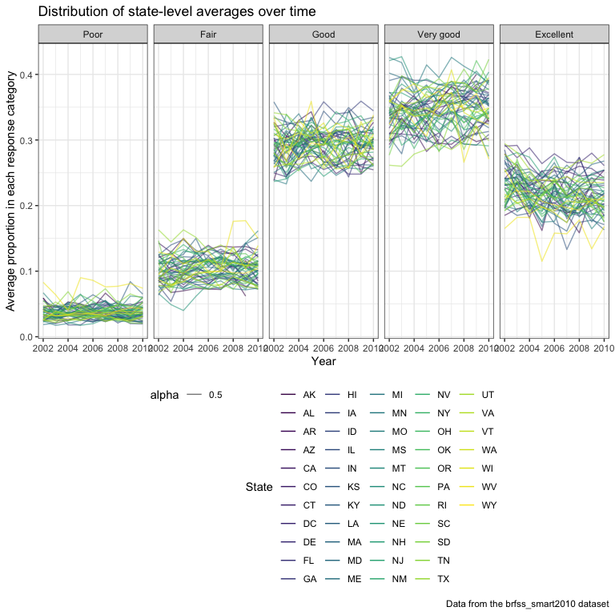

Homework 3 - deg2163
================
Diana Ballesteros Gonzalez
10/11/2018

``` r
knitr::opts_chunk$set(echo = TRUE)

library(tidyverse)
```

    ## ── Attaching packages ──────────────────────────────────── tidyverse 1.2.1 ──

    ## ✔ ggplot2 3.0.0     ✔ purrr   0.2.5
    ## ✔ tibble  1.4.2     ✔ dplyr   0.7.6
    ## ✔ tidyr   0.8.1     ✔ stringr 1.3.1
    ## ✔ readr   1.1.1     ✔ forcats 0.3.0

    ## ── Conflicts ─────────────────────────────────────── tidyverse_conflicts() ──
    ## ✖ dplyr::filter() masks stats::filter()
    ## ✖ dplyr::lag()    masks stats::lag()

``` r
library(ggridges)
```

    ## 
    ## Attaching package: 'ggridges'

    ## The following object is masked from 'package:ggplot2':
    ## 
    ##     scale_discrete_manual

``` r
knitr::opts_chunk$set(
  fig.width = 6,
  fig.asp = .6,
  out.width = "90%"
)

theme_set(theme_bw() + theme(legend.position = "bottom"))
```

***Problem 1***
===============

``` r
# install.packages("devtools")
devtools::install_github("p8105/p8105.datasets")
```

    ## Skipping install of 'p8105.datasets' from a github remote, the SHA1 (21f5ad1c) has not changed since last install.
    ##   Use `force = TRUE` to force installation

``` r
## loading the library
library(p8105.datasets)
```

``` r
## Load the data for brfss_smart2010
data("brfss_smart2010")
```

``` r
## cleaning the dataset 
brfss_smart2010_clean = 
   brfss_smart2010 %>% 
   janitor::clean_names() %>% 
   rename(state = locationabbr, county = locationdesc) %>% 
   filter(topic == "Overall Health" & (response == "Excellent" | response == "Very good" |
                                       response == "Good" | response == "Fair" | 
                                       response == "Poor")) %>% 
   mutate(response = ordered(response, levels = c("Poor", "Fair", "Good", "Very good", "Excellent")))
```

``` r
## In 2002, which states were observed at 7 locations? Answer: CT, FL, and NC
brfss_smart2010_clean %>% 
  filter(year == 2002) %>% 
  group_by(state) %>% 
  distinct(county) %>% 
  count() %>% 
  filter(n == 7) 
```

    ## # A tibble: 3 x 2
    ## # Groups:   state [3]
    ##   state     n
    ##   <chr> <int>
    ## 1 CT        7
    ## 2 FL        7
    ## 3 NC        7

``` r
## Make a “spaghetti plot” that shows the number of locations in each state from 2002 to 2010.
brfss_smart2010_clean %>% 
  group_by(state, year) %>% 
  distinct(county) %>%
  summarize(count_county = n()) %>% 
  ggplot(aes(x = year, y = count_county, color = state)) + 
  geom_line() + 
  labs(
    title = "Number of locations in each state from 2002 to 2010",
    x = "Year",
    y = "Number of locations in each state",
    caption = "Data from the brfss_smart2010 package"
  ) + 
  viridis::scale_color_viridis(
    name = "States", 
    discrete = TRUE) + 
  theme_bw() 
```


``` r
## ## Make a table showing, for the years 2002, 2006, and 2010, the mean and standard deviation of the proportion of “Excellent” responses across locations in NY State. 
## SD I keep getting NA, need to convert from percentage to prop
brfss_smart2010_clean %>% 
  filter((year == 2002 | year == 2006 | year == 2010) & (state == "NY") 
         & response == "Excellent") %>% 
  group_by(year, state, county) %>% 
  spread(key = response, value = data_value) %>%
  janitor::clean_names() %>% 
  summarize(mean_excellent = mean(excellent),
            sd_excellent = sd(excellent)) %>% 
  knitr::kable()
```

|  year| state | county                  |  mean\_excellent|  sd\_excellent|
|-----:|:------|:------------------------|----------------:|--------------:|
|  2002| NY    | NY - Kings County       |             19.5|             NA|
|  2002| NY    | NY - Nassau County      |             26.9|             NA|
|  2002| NY    | NY - New York County    |             27.9|             NA|
|  2002| NY    | NY - Queens County      |             18.8|             NA|
|  2002| NY    | NY - Suffolk County     |             27.1|             NA|
|  2006| NY    | NY - Kings County       |             19.2|             NA|
|  2006| NY    | NY - Nassau County      |             21.7|             NA|
|  2006| NY    | NY - New York County    |             28.8|             NA|
|  2006| NY    | NY - Queens County      |             18.9|             NA|
|  2006| NY    | NY - Suffolk County     |             20.6|             NA|
|  2006| NY    | NY - Westchester County |             26.0|             NA|
|  2010| NY    | NY - Bronx County       |             17.6|             NA|
|  2010| NY    | NY - Erie County        |             17.2|             NA|
|  2010| NY    | NY - Kings County       |             22.4|             NA|
|  2010| NY    | NY - Monroe County      |             22.4|             NA|
|  2010| NY    | NY - Nassau County      |             26.2|             NA|
|  2010| NY    | NY - New York County    |             25.8|             NA|
|  2010| NY    | NY - Queens County      |             21.2|             NA|
|  2010| NY    | NY - Suffolk County     |             24.6|             NA|
|  2010| NY    | NY - Westchester County |             26.9|             NA|

``` r
## For each year and state, compute the average proportion in each response category (taking the average across locations in a state). Make a five-panel plot that shows, for each response category separately, the distribution of these state-level averages over time.
brfss_smart2010_clean %>% 
  group_by(year, state, response) %>% 
  summarize(mean_response_category = mean(data_value/100)) %>% 
  ggplot(aes(x = year, y = mean_response_category, color = state)) + 
  geom_line() + 
  facet_grid(~response) + 
  labs(
    title = "Distribution of state-level averages over time",
    x = "Year",
    y = "Average proportion in each response category",
    caption = "Data from the brfss_smart2010 dataset"
  ) + 
  viridis::scale_color_viridis(
    name = "State", 
    discrete = TRUE
  )
```

    ## Warning: Removed 3 rows containing missing values (geom_path).



### ***Problem 2***

``` r
## Load the data for instacart
data("instacart")
instacart = instacart 
```

Description of the dataset: There are 15 variables in the dataset that include information including when the items were ordered, days since the customer's last order, product name, aisle the item was located at, product id, order id, whether the item was reorder, user's id. There are some variables that are not clearly defined including eval\_set,order\_dow. I am assuming that order\_dow is referring to the day of the week the order was placed from 0-6 with 0 being Saturday according to some online research since those are the days with the most instacart orders. The dataset is structured so that each row is a different item from an order that was placed (i.e., 1,384,617 items were ordered via instacart).

``` r
## How many aisles are there?
instacart %>% 
 distinct(aisle_id) %>%
 count()
```

    ## # A tibble: 1 x 1
    ##       n
    ##   <int>
    ## 1   134

There are 134 aisles.

``` r
## Which aisles are the most items ordered from?
instacart %>% 
  group_by(aisle) %>% 
  count(aisle) %>% 
  arrange(desc(n)) %>% 
  head() %>% 
  knitr::kable()
```

| aisle                         |       n|
|:------------------------------|-------:|
| fresh vegetables              |  150609|
| fresh fruits                  |  150473|
| packaged vegetables fruits    |   78493|
| yogurt                        |   55240|
| packaged cheese               |   41699|
| water seltzer sparkling water |   36617|

``` r
instacart %>% 
  group_by(aisle) %>% 
  count(aisle) %>%
  ggplot(aes(x = aisle, y = n)) + 
  geom_point() + 
  labs(
    title = "Number of items ordered in each aisle",
    x = "Aisle",
    y = "Number of items ordered per aisle",
    caption = "Data from the instacart dataset"
  ) + 
 theme(axis.text.x = element_text(angle = 60, hjust = 1))
```


``` r
## Make a table showing the most popular item in each of the aisles “baking ingredients”, “dog food care”, and “packaged vegetables fruits”.
instacart %>% 
  filter(aisle == "baking ingredients" | 
         aisle == "dog food care" | 
         aisle == "packaged vegetables fruits") %>% 
  group_by(aisle) %>% 
  summarize(most_popular_item = max(product_name)) %>%
  knitr::kable()
```

| aisle                      | most\_popular\_item             |
|:---------------------------|:--------------------------------|
| baking ingredients         | Zero Calorie Sweetener          |
| dog food care              | Zero Grain Turkey Dog Food      |
| packaged vegetables fruits | Zucchini Squash, Baby Courgette |

``` r
## Make a table showing the mean hour of the day at which Pink Lady Apples and Coffee Ice Cream are ordered on each day of the week; format this table for human readers (i.e. produce a 2 x 7 table).
instacart %>% 
  filter(product_name == "Pink Lady Apples" | 
         product_name == "Coffee Ice Cream") %>% 
  group_by(product_name, order_dow) %>% 
  summarize(mean_order_hour_of_day = mean(order_hour_of_day)) %>%
  spread(key = order_dow, value = mean_order_hour_of_day) %>% 
  rename("Product Name" = "product_name", "Saturday" = "0", 
         "Sunday" = "1", "Monday" = "2", "Tuesday" = "3", 
         "Wednesday" = "4", "Thursday" = "5", "Friday" = "6") %>% 
  knitr::kable(digits = 2)
```

| Product Name     |  Saturday|  Sunday|  Monday|  Tuesday|  Wednesday|  Thursday|  Friday|
|:-----------------|---------:|-------:|-------:|--------:|----------:|---------:|-------:|
| Coffee Ice Cream |     13.77|   14.32|   15.38|    15.32|      15.22|     12.26|   13.83|
| Pink Lady Apples |     13.44|   11.36|   11.70|    14.25|      11.55|     12.78|   11.94|
